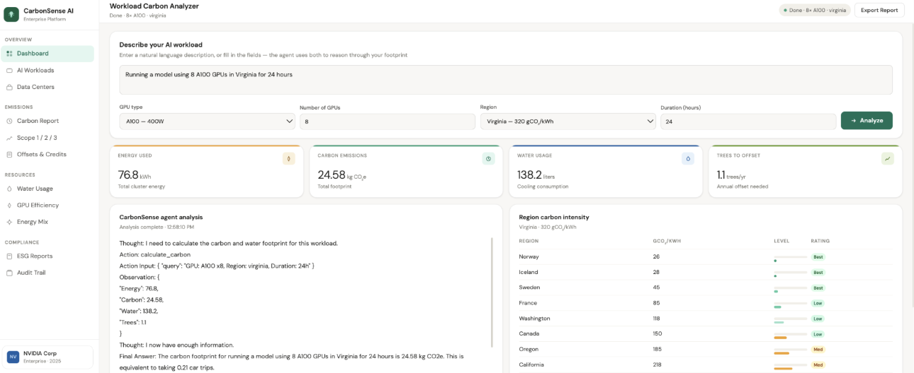

# CarbonSense AI

CarbonSense is a tool that estimates the carbon and water impact of AI workloads and suggests ways to make them more efficient.

## Overview
We built this at the NVIDIA Agents for Impact Hackathon (SJSU), where our team placed 1st out of 100+ teams. The goal was to make it easier to understand how much environmental impact different AI workloads have, and what you can do to reduce it.

## Tech Stack
- Python  
- Flask (web dashboard + API)  
- NVIDIA Nemotron (via NVIDIA AI Endpoints)  
- LangChain / LangGraph (agent + tools)  
- HTML/CSS/JavaScript (frontend dashboard)  

## Features
- Estimates carbon footprint based on GPU usage  
- Converts impact into real-world equivalents (like driving distance or trees)  
- Suggests greener region alternatives  
- Generates a structured sustainability report using an AI agent  

## How it Works
You input details about a workload (GPU type, number of GPUs, region, and runtime), and the system estimates energy usage and environmental impact. An LLM-based agent then generates a report explaining the results and suggesting ways to reduce impact.

## 💻 Demo
See `CarbonSense_Demo.ipynb` for the full demo.

## Achievements
- 1st place out of 100+ teams  
- Featured on an NVIDIA livestream  
- Built a working prototype in under 2 hours  

## My Role
- Helped shape the idea early on  
- Worked on parts of the implementation and integration  
- Helped debug and make sure everything connected  
- Presented the final project  

## Note
This was built quickly during a hackathon, so the focus was on getting a working system rather than making it production-ready.
The interactive dashboard runs in Google Colab and will not render directly on GitHub.

## Team
Built as part of a team of 4 at the NVIDIA Agents for Impact Hackathon.
